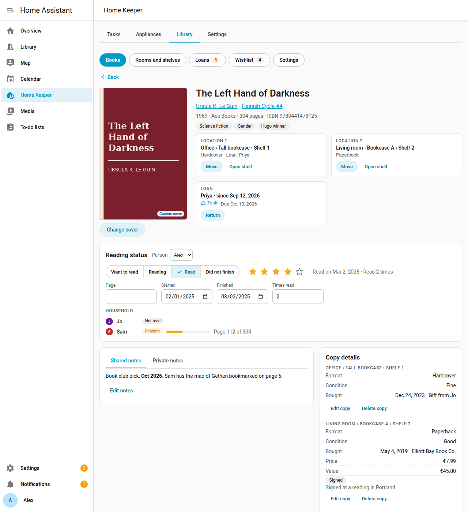
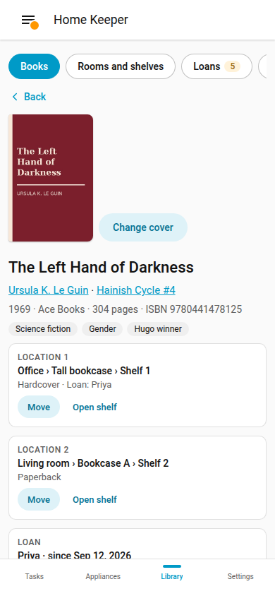

# Book detail

Select a book in the list to open its detail page. The page shows the location of each
copy, the reading status of the household, the notes, and the details of each copy.

## Location and loan

**Location** shows the room, the bookcase and the shelf of each copy. Select **Open
shelf** to open the books of that shelf. If a copy is lent out, **Loan** shows who has it
and the due date. Select **Return** when the book comes back.

## Reading status

Set your reading status in **Reading status**:

- **Want to read**
- **Reading**
- **Read**
- **Did not finish**

**Reading** with no start date sets the start date to today. **Read** with no finished
date sets the finished date to today, and adds 1 to the read count.

Set a rating of 1 to 5 stars and the page that you are on. You can also change the start
date and the finished date.
An admin can set the status of each person. **Household** shows the reading status of the
other people who share their reading.

## Notes

- **Shared notes** are for the whole household.
- **Private notes** are for your person. Only you and the admins read them.

Both support Markdown. Select **Edit notes** to change them.

## Cover

The library downloads the cover from Open Library when it adds a book.

- Select **Change cover** to upload a photo. The library accepts a JPEG, PNG or WebP file
  of up to 10 MB. The stored cover is a JPEG of at most 1200 px.
- Select **Use Open Library cover** to go back to the cover from Open Library.

## Copies and value

**Copy details** shows the format and the condition of each copy. It also shows the date
and the source of the purchase, the price and the value, and the signed and first edition
marks. Only admins see the price, the value and the source. The currency is the currency
of the integration.

- Select **Add copy** to add 1 more copy, on a shelf.
- Select **Edit copy**, **Move** or **Delete copy** on a copy.

## Change the book

- **Edit**: change the details of the book.
- **Lend**: lend a copy ([Loans](loans.md)).
- **Update from Open Library**: fill the empty details from Open Library. The library
  keeps each detail that you changed.
- **Delete**: delete the book with its copies, its reading status and its loans.

## Phone

The detail page works at phone width.
