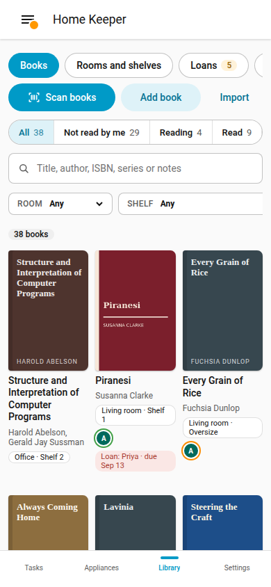

# Books

The **Books** page of the Library tab lists the books of the library, with a search and
filters. Use it to find a book and its shelf, or to see what a person has read.

## Search

Type in **Search books**. The search reads the title and the authors of each book, and
also the ISBN, the series, the tags and the notes.

## Filters

| Filter | Values |
|---|---|
| Status | **All**, **Not read by me**, **Reading**, **Read**, **Needs details** |
| **Room** and **Shelf** | The books with a copy in that place |
| **Read by** | The books that a person has read |
| **Subject** | A subject from Open Library |
| **Owned** | **Owned**, **Not owned** or **All books**. The default is **Owned**. |
| **Sort** | **Author**, **Title**, **Date added**, **Year published**, **My rating** |

The status filters show the status of your own person. **Needs details** shows the books
that have no details from Open Library yet. **Not owned** shows the books with no copy,
such as library books that a person read, and the wishlist.

Select **Clear filters** to show all books again. Each filter is in the address of the
page, so a bookmark keeps the filters.

## Layout

Select **Cover grid** or **Rows** in **Layout**. The rows show more books on 1 screen.

## Add a book

- Select **Scan books** to [scan](scan-books.md) books into a shelf.
- Select **Add book** and enter an ISBN or a title. With **Get details from Open
  Library**, the library fills the details from the ISBN. You can add a copy to a shelf
  in the same step.
- Select **Import** to [import](import-export.md) a Goodreads or StoryGraph file.

If a book with the same ISBN is in the library, the library shows that book and adds no
second book.

## Phone

The Books page works at phone width.
