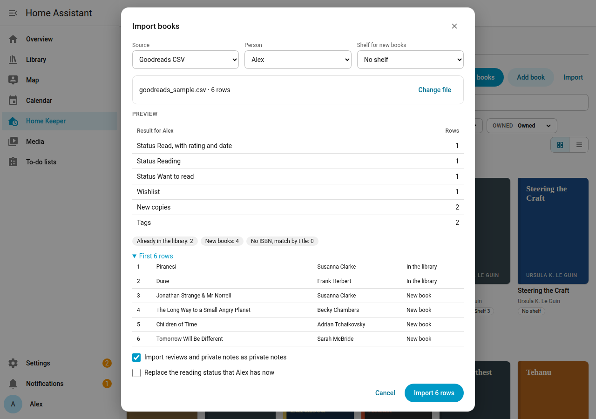

# Import and export

The library supports an import of a CSV file from Goodreads or StoryGraph, and an export
to a CSV file in the Goodreads format. Use it to bring a reading history into
the library, or to move the library to another Home Assistant.

## Export from Goodreads

1. Sign in to Goodreads on a computer.
2. Open **My Books**, then **Import and export** in the left column.
3. Select **Export Library**.
4. When the file is ready, download it. The file name is like
   `goodreads_library_export.csv`.

For StoryGraph, open **Manage account**, then **Export StoryGraph library**, and
download the CSV file.

## Import a file

1. Open the **Books** page of the Library tab, and select **Import**.
2. In **Source**, select **Goodreads CSV**, **StoryGraph CSV** or **Home Keeper Library
   CSV**.
3. Select the **Person** whose reading status the file holds.
4. Select a **Shelf for new books**, or no shelf.
5. Select **Choose file** and select the CSV file. The file must be 5 MB or smaller.
6. Read the **Preview**. It shows the counts and the result for the first 200 rows. The
   preview changes nothing.
7. Select **Import** to write the rows.

Options:

- **Import reviews and private notes as private notes**: on by default.
- **Replace the reading status that** *person* **has now**: off by default. With it off,
  a book that already has a reading status for the person keeps it.

## How rows match books

The library looks for each row in this order:

1. The ISBN-13.
2. The ISBN-10.
3. The title and the first author.

A row that matches no book adds a new book. The library then reads Open Library for the
details and the cover of each new book, after the import.

## What a Goodreads row gives

| Goodreads | Library |
|---|---|
| **read** shelf | Status Read, with the rating, the date read and the read count |
| **currently-reading** shelf | Status Reading |
| **to-read** shelf, with an owned copy | Status Want to read |
| **to-read** shelf, with no owned copy | The wishlist of the person |
| Owned copies | 1 copy on the shelf for new books, if the book has no copy. The format comes from the binding. |
| Other shelves | Tags |
| Review and private notes | Private notes |

StoryGraph rows give the same, from the read status, the star rating, **Owned?**, the
format, the tags and the review. A star rating with a decimal rounds to the nearest whole
star.

## Export

Open the **Settings** page of the Library tab. In **Export**, select a person or **All
books, no reading status**, select the format, and select **Export CSV**.

- **Goodreads CSV** has the Goodreads columns. Goodreads and StoryGraph import it.
- **Home Keeper Library CSV** has every book and copy field and the location of each
  copy. Import it into another Home Keeper Library to move the library.

The file name has the format and the date, such as `library-goodreads-2026-10-05.csv`.
