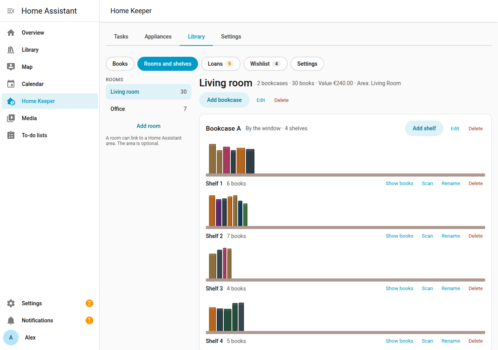
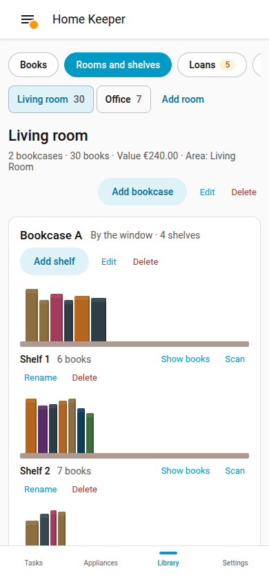

# Rooms and shelves

The library supports a location for each copy. The location is a shelf of a bookcase in
a room. A search then shows the shelf of each book.

## Add a room, a bookcase and shelves

1. Open the **Library** tab of the Home Keeper panel, and select **Rooms and shelves**.
2. Select **Add room**. Enter a name. As an option, link the room to a Home Assistant area.
3. Select the room, then **Add bookcase**. Enter a name and the number of shelves.
4. To add 1 more shelf later, select **Add shelf** on the bookcase.

Select **Show books** on a shelf to open the book list for that shelf. Select **Scan** on
a shelf to [scan books](scan-books.md) into it.

## Change or delete a location

- Select **Edit** on a room or a bookcase, or **Rename** on a shelf.
- Select **Delete** to delete it. If the shelf has copies, or the room or bookcase has
  shelves, the tab asks first. The copies on it then have no shelf.

## Copies with no shelf

A copy can have no shelf, such as a copy that a scan added with no shelf selected. The
page shows the number of copies with no shelf. Select **Set shelf** to give a copy a shelf.

## Phone

The page works at phone width. Select a room to open its bookcases.
