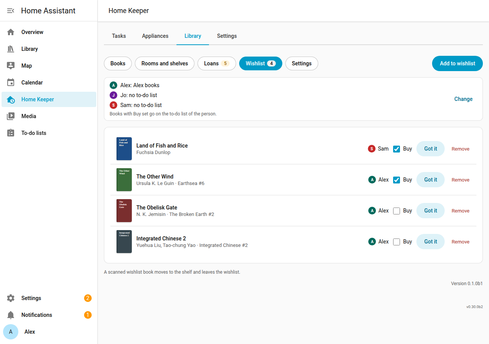

# Wishlist

The library supports a wishlist for each person. The wishlist holds the books that the
person wants to get. A wishlist book with **Buy** set goes on a to-do list of that person
as "*Title* by *Author*".

## Add a book to the wishlist

1. Open the **Wishlist** page of the Library tab, and select **Add to wishlist**.
2. Enter the ISBN or the title, and select the person.
3. Set **Buy** if the book must go on the to-do list now.
4. Select **Save**.

You can also select **Add to wishlist** on the detail page of a book. A book is on the
wishlist of 1 person at a time. A Goodreads or StoryGraph import puts each "to-read" book
with no owned copy on the wishlist ([Import and export](import-export.md)).

## Got it

When the book arrives, select **Got it** and select the shelf and the format. The library
adds a copy and removes the book from the wishlist.

## Per-person to-do list

An admin selects the to-do list of each person in the **Settings** page, in **Wishlist
to-do list**. The list must be an existing `todo` entity. It is not the shopping list of
Home Keeper, unless you select that list.

- A book with **Buy** set gets 1 item on the list of its person.
- When the person completes the item, the library marks the book **Bought**.
- When **Buy** turns off or the book leaves the wishlist, the library removes the item.
- If a person deletes the item from the list, **Buy** turns off. Set **Buy** again to put
  the item back.
- The library never changes a completed item.

The library checks the lists after each change and every 10 minutes. If a list is not
available, the library tries again later and removes no item.
