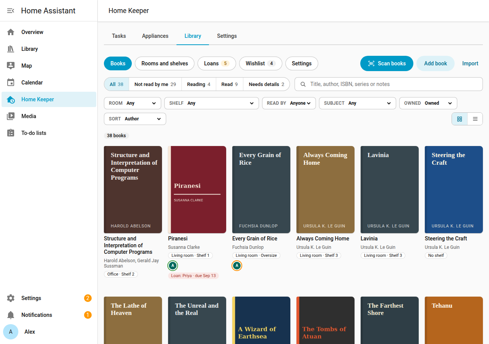

# Home Keeper Library

Home Keeper Library is a Home Assistant integration for the books of a household. It
records where each book is, who reads it, who borrowed it and what to buy next.

**Home Keeper Library requires Home Keeper.** Install and set up
[Home Keeper](https://github.com/prestomation/ha-home-keeper) first. The library adds a
**Library** tab to the Home Keeper panel, and puts the return date of each loan in Home
Keeper as a task.

## What the library records

| Name | What it is |
|---|---|
| Room | A room of the home. It can link to a Home Assistant area. |
| Bookcase | A piece of furniture in a room. It holds shelves. |
| Shelf | 1 shelf of a bookcase. |
| Book | A title, with its authors, ISBN, cover, series and notes. |
| Copy | 1 book that the household owns, on a shelf, in a format. A book can have 0, 1 or more copies. |
| Reading status | Want to read, Reading, Read or Did not finish, for 1 person. |
| Loan | A copy that the household lent out, or a book that a person borrowed. |
| Wishlist | The books that a person wants to get. |

A book with no copy is valid. Examples are a library book in the reading history of a
person and a book on the wishlist.

## Features

- [Rooms and shelves](../library/rooms-and-shelves.md): the rooms of the home and their
  bookcases and shelves.
- [Scan books](../library/scan-books.md): fill a shelf with the camera of a phone.
- [Books](../library/books.md): search and filter the library.
- [Book detail](../library/book-detail.md): the reading status and the notes of a book,
  with its cover and copies.
- [Loans](../library/loans.md): the books that the household lent out or borrowed.
- [Wishlist](../library/wishlist.md): a wishlist and a to-do list for each person.
- [Import and export](../library/import-export.md): the CSV files of Goodreads and
  StoryGraph.
- [Dashboard card](../views/dashboard-card.md): the reading of a person on a dashboard.
- [People and privacy](people-and-privacy.md): what each user can read and change.
- [Services and events](../automation/services.md): automations and other integrations.

## Admins and users

An admin manages the library in the **Library** tab of the Home Keeper panel. Every user
can set the reading status of their own person on the dashboard card. Every user can use
the entities of the library too. Book details and covers come from
[Open Library](https://openlibrary.org).
